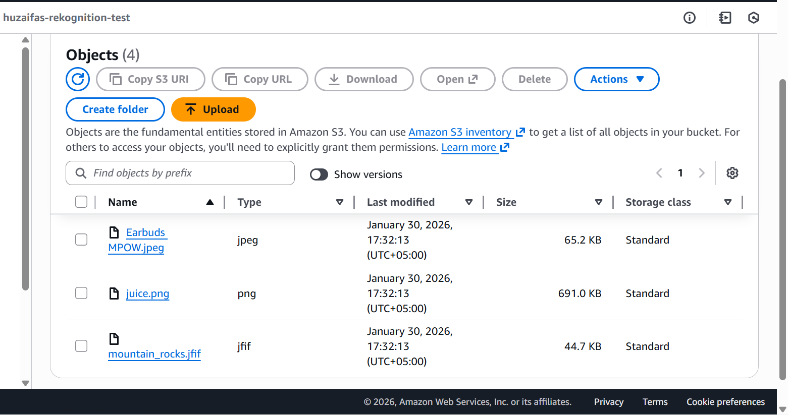
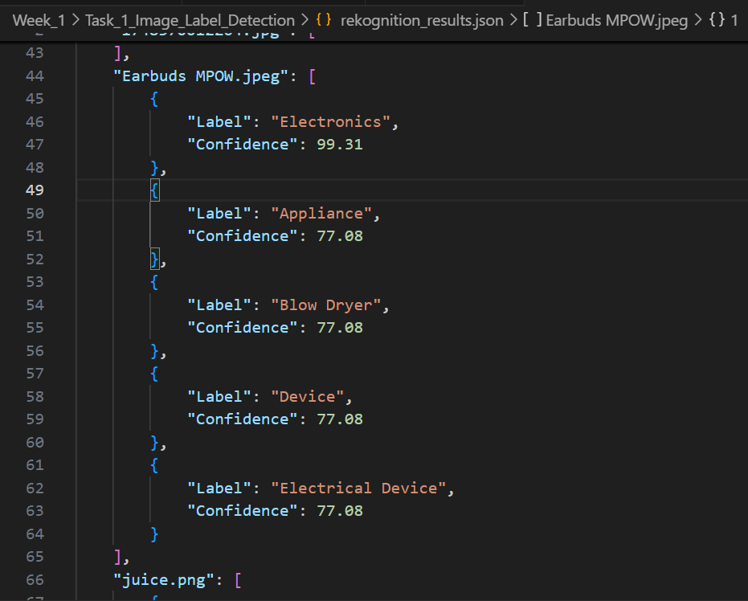

# Image Analysis with Amazon Rekognition

## Overview
This task uses **Amazon Rekognition** to analyze images stored in an S3 bucket. The service detects labels present in images and returns confidence scores for each detected label.

The detected labels and their confidence scores are saved to a JSON file.

---

## AWS Services Used
- Amazon S3
- Amazon Rekognition
- AWS CloudShell

---

## Workflow
1. Images are uploaded to an S3 bucket
2. A Python script calls `detect_labels` using Boto3
3. Rekognition analyzes the image content
4. Detected labels and confidence scores are stored in a JSON file

---

## Key Points
- Rekognition **automatically detects labels**
- No predefined labels are required
- Image names are specified only to select which images to analyze
- Supported formats include JPG, JPEG, PNG, etc.

## Task Description
Upload images to an S3 bucket (huzaifas-rekognition-test).
Using CloudShell with Amazon Rekognition detect labels from images stored in S3 bucket (huzaifas-rekognition-test).

---

Attached IAM roles with policies

### Policies
- AmazonRekognitionFullAccess
- AmazonS3FullAccess

## Detected Labels Sample Output (JSON)

