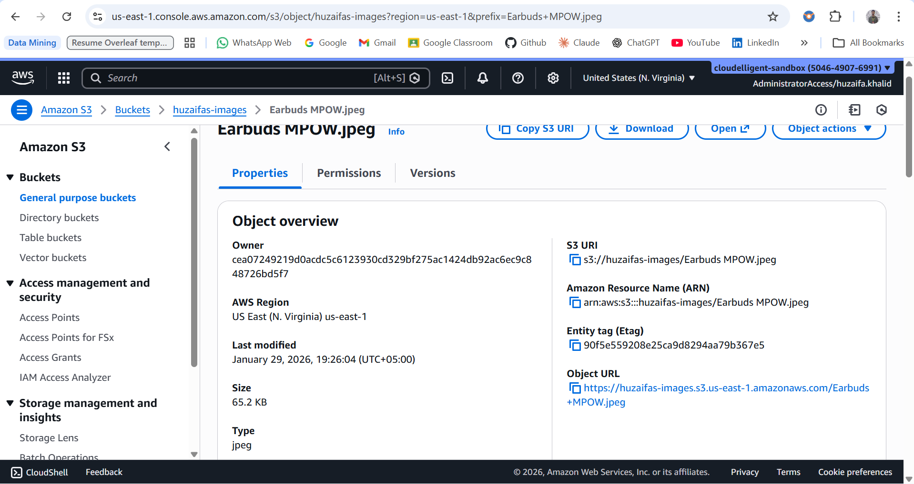
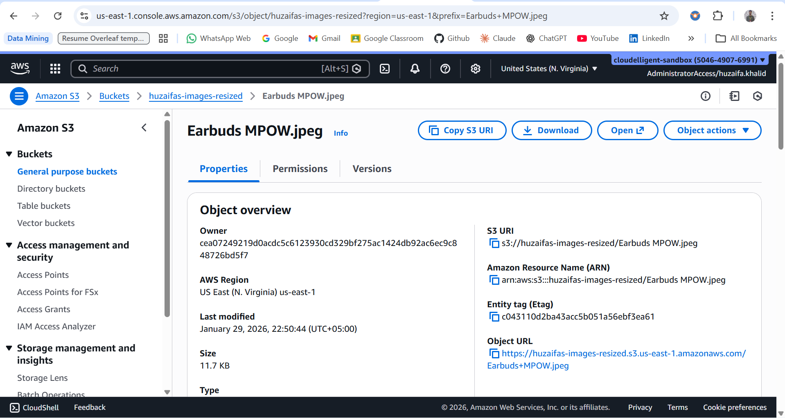
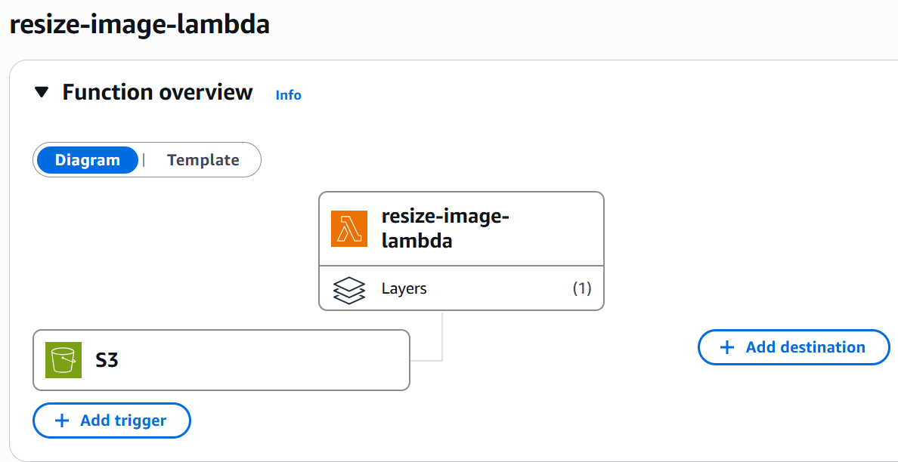
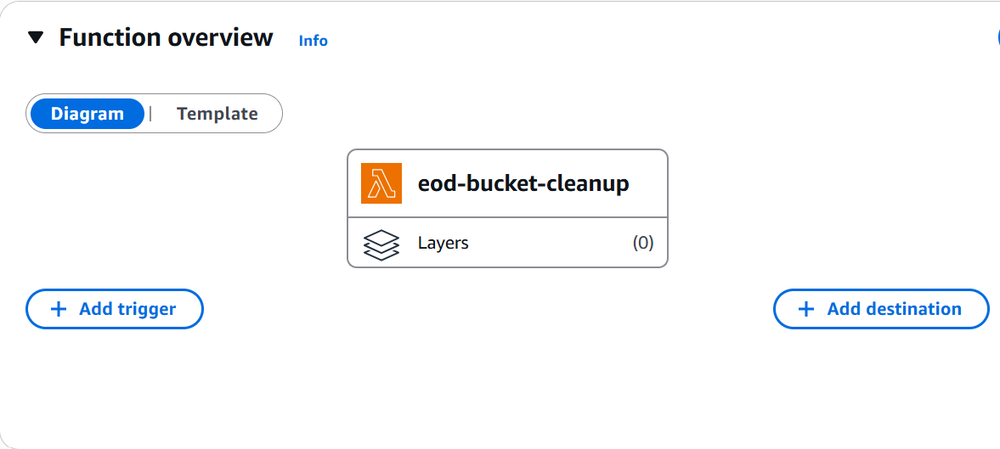

# Image Resizing using AWS Lambda and S3

## Overview
This task demonstrates an automated image resizing using AWS services. When an image is uploaded to an S3 bucket, an AWS Lambda function resizes the image and stores the resized version in another S3 bucket.

The solution uses **AWS Lambda**, **Amazon S3**, and the **Pillow (PIL)** library.

---

## User Flow
1. User uploads an image to the **original images S3 bucket**
2. An **S3 event trigger** invokes the Lambda function
3. Lambda uses **Pillow** to resize the image
4. The resized image is saved to a **separate S3 bucket**

---

## AWS Services Used
- Amazon S3
- AWS Lambda
- AWS Lambda Layers (Pillow)
- AWS EventBridge (cron job for auto cleanup at EOD)

---

## Task Description

Two Buckets were provisioned, one for original image (65KB) and another for resized image.
Original-Image in S3 bucket (huzaifas-images)

Resized-Image in S3 bucket (huzaifas-resized-images)

Created an Image Resize Lambda function that automatically triggers when image is uploaded to S3 bucket (huzaifas-images).
Which is then resized into the resized image bucket (huzaifas-resized-images).

Also created an EOD Bucket cleanup function that frees up Original S3 bucket at 18:59:00 UTC ie. 23:59:00 PKT.

---

## Testing
- The Lambda function was tested using the AWS Console
- Only image **objects** were modified/deleted (no buckets were deleted)

---

## Outcome
- Images uploaded to the source bucket are resized automatically
- Resized images are stored in the destination bucket
- Function executes successfully without errors
