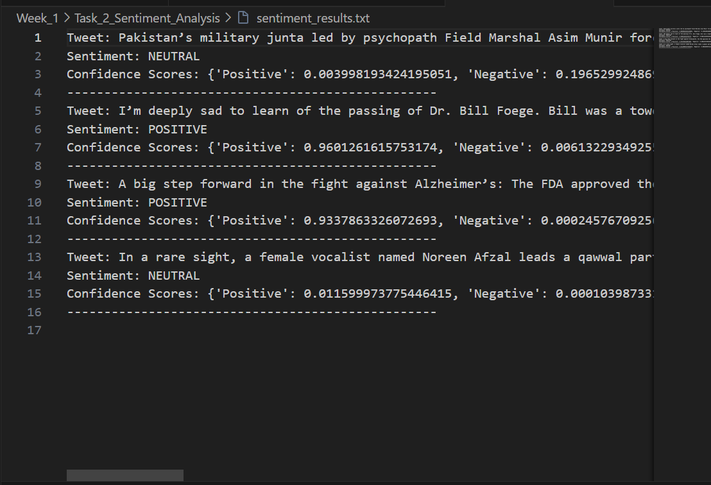

# Sentiment Analysis using Amazon Comprehend

## Overview
This task performs sentiment analysis on short text inputs (tweets) using **Amazon Comprehend**. The service determines whether the sentiment is Positive, Negative, Neutral, or Mixed.

---

## AWS Services Used
- Amazon Comprehend
- AWS CloudShell

---

## Workflow
1. Tweets are provided as text input in a Python script
2. The script calls `detect_sentiment` using Boto3
3. Amazon Comprehend analyzes the text
4. Sentiment and confidence scores are returned
5. Output is printed and optionally saved to a text file

---

## Sentiment Analysis of Tweets (from X)

